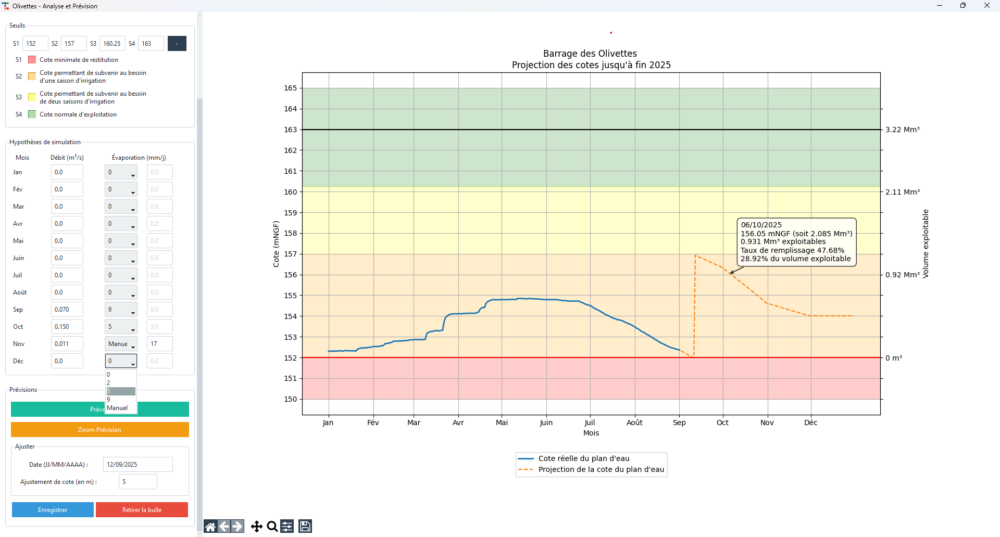

# Olivettes - Water Level Analysis and Forecasting

## Description
Olivettes is a desktop Python application for analyzing and forecasting water levels of a reservoir (Olivettes Dam). It allows you to:

- Load water level data from CSV files.
- Visualize levels on interactive charts.
- Define critical thresholds and operational zones.
- Simulate level forecasts based on outflow and evaporation.
- Manually adjust forecasted values.
- Export charts as PNG, PDF, or JPEG.

The application uses **Tkinter** with the **Flatly** theme via **ttkbootstrap**, as well as **matplotlib**, **pandas**, **scipy**, and **mplcursors** for interactive plots.

---

## Main Features



### CSV Data Loading
- The CSV must contain a **date** column (or datetime index) and a **COTE** column (water level in mNGF).  
- The column `"Cote du plan d'eau (mNGF)"` is automatically renamed to `COTE`.

### Interactive Visualization
- Matplotlib charts embedded in the Tkinter interface.
- Navigation via toolbar (zoom, pan, save).
- Interactive tooltips showing date, water level, total volume, and usable volume.

### Level Forecasting
- Based on historical data and monthly assumptions:
  - Outflow (m³/s)
  - Evaporation (mm/day)
- Charts display colored areas corresponding to critical thresholds.

### Manual Adjustments
- Allows adjusting the level for a specific date to refine the forecast.

### Chart Export
- Export charts as PNG, PDF, or JPEG.
- Option to remove interactive tooltips before exporting.

---

## Installation

### Prerequisites
- Python 3.10+
- Python modules:
```bash
pip install pandas matplotlib scipy ttkbootstrap mplcursors
```
Required HSV file: HSV_32.txt (contains the relations COTE ↔ VOLUME ↔ SURFACE)

### PyInstaller Option
```
pyinstaller --onefile --noconsole app_olivettes.py \
--add-data "HSV_32.txt;." \
--add-data "<path_to_python>/Lib/site-packages/matplotlib/mpl-data;matplotlib/mpl-data" \
--hidden-import=matplotlib.backends.backend_pdf
```


